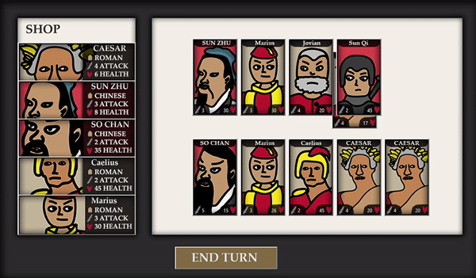
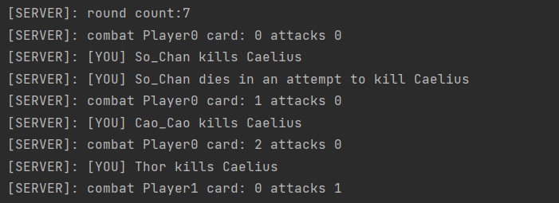
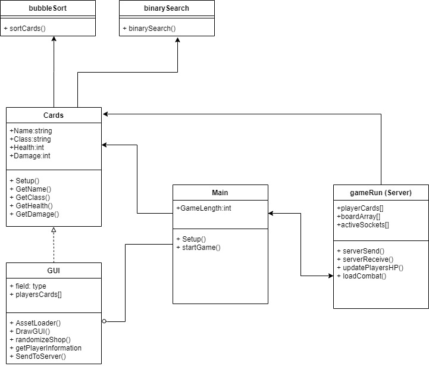

# PCSS-AutoCardgame

#### Mini-Project for the Programming of Complex Software Systems course (BSc. Medialogy 3rd semester, AAU), 2020

This program is an automatic card game with an ancient warlords theme.

## Showcase

## Running the program

Start the program by running the main.py file.

Then start the server by running the gameRun.py file.

Create your deck, by picking 5 cards from the shop and press the "end turn", when you are ready for combat.
  

## About
Project made for the Programming of Complex Software Systems course by Lukas Kristensen
